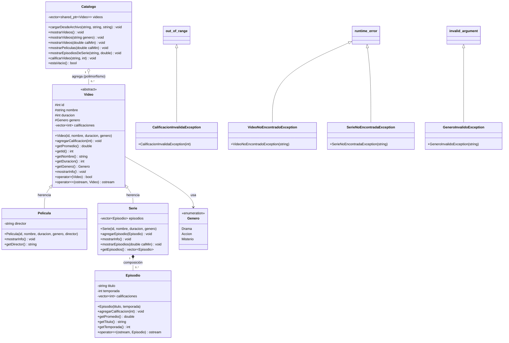
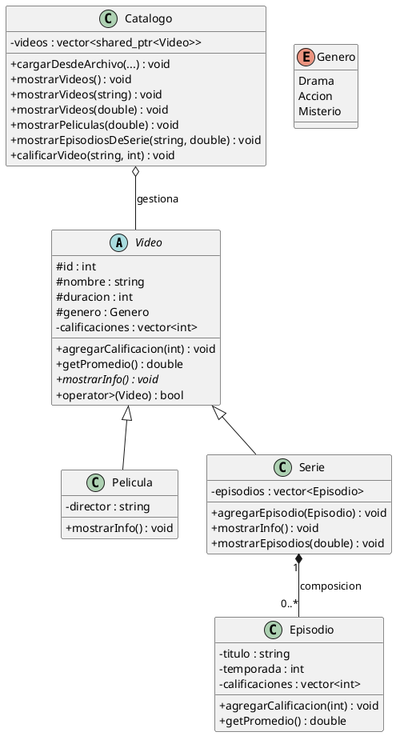

# Diagrama UML — StreamingPOO

## Mermaid (pega en https://mermaid.live)

---

## PlantUML (pega en https://plantuml.com/plantuml)

---

## Relaciones

| Relación              | Tipo        | Descripción                                       |
|-----------------------|-------------|---------------------------------------------------|
| Video → Pelicula      | Herencia    | Pelicula extiende Video                           |
| Video → Serie         | Herencia    | Serie extiende Video                              |
| Serie ◆→ Episodio     | Composición | Serie posee y gestiona sus episodios              |
| Catalogo ◇→ Video     | Agregación  | Catalogo administra videos mediante polimorfismo  |
