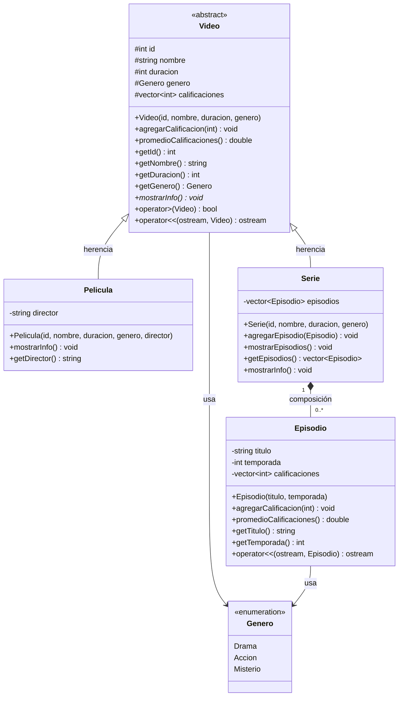

# Diagrama UML — StreamingPOO

Pega este código en [mermaid.live](https://mermaid.live) para visualizarlo.

---

## Relaciones

| Relación               | Tipo         | Descripción                                      |
|------------------------|--------------|--------------------------------------------------|
| `Video → Pelicula`     | Herencia     | Pelicula extiende Video                          |
| `Video → Serie`        | Herencia     | Serie extiende Video                             |
| `Serie ◆→ Episodio`    | Composición  | Serie contiene y gestiona sus propios episodios  |
| `Video → Genero`       | Dependencia  | Video utiliza el enum Genero                     |
